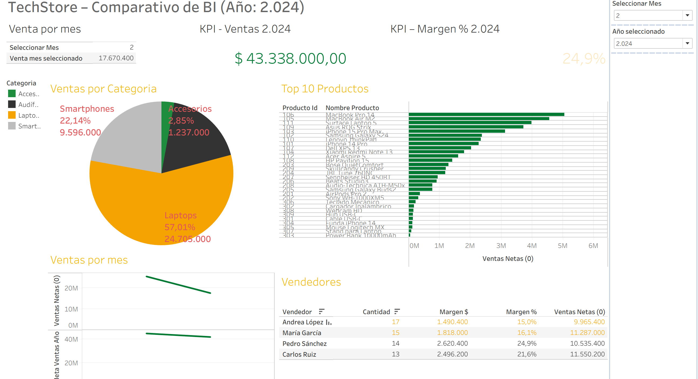
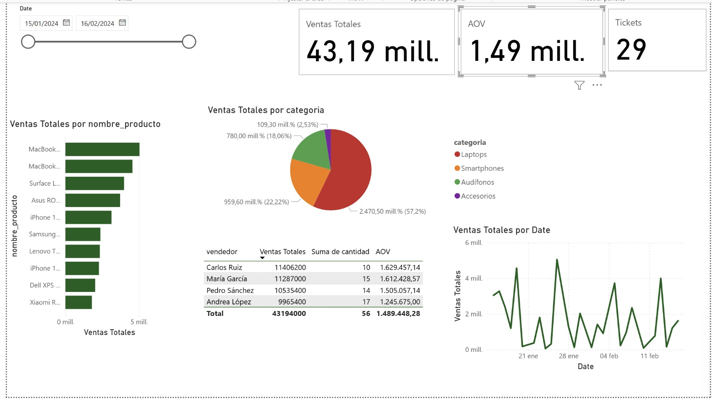

# Comparativo: Tableau vs Power BI (TechStore – Lab 1)

Este documento resume cómo se abordó el mismo caso de negocio en **Tableau** y **Power BI**, los elementos construidos en cada herramienta, y las lecciones aprendidas.  

## 1) Carpeta del repositorio

- `tableau/` → Tablero, campos calculados y README del Lab 1 en Tableau  
- `powerbi/` → Reporte `.pbix`, capturas y README del Lab 1 en Power BI  

---

## 2) Métricas y KPIs comunes

| Métrica | Descripción |
|---------|------------|
| Ventas Netas | Total de ventas considerando descuentos |
| Costo Total | Suma de costos por venta |
| Margen $ y % | Diferencia entre ventas y costos |
| Meta Ventas Año / Mes | Comparativo con objetivo anual y mensual |
| Cumplimiento % | Ventas Netas / Meta Ventas |
| Estado/Bandas | Indicador de desempeño por color según Cumplimiento y Margen |

---

## 3) Visualizaciones equivalentes

- **KPI de Ventas**  
- **KPI de Cumplimiento %**  
- **Top 10 productos** (barras horizontales por ventas)  
- **Ventas por categoría** (gráfico circular / Pie)  
- **Tabla de Vendedores** (Cantidad, Margen $, Margen %, Ventas Netas)  

### Diferencias observadas

- **Power BI**: KPI adicional de Clientes Activos y gráfico dual “Ventas Netas vs Meta Ventas Mes” con tema JSON de Manuelita.  
- **Tableau**: Measure Names/Values para tabla de Vendedores; parámetros/filtros para seleccionar año/mes.  

---

## 4) Resultados y consistencia

- **Tableau (KPI Ventas)**: ~$46.467.000  
- **Power BI (KPI Ventas)**: ~$43,34 M  
- Diferencia explicada por filtros de fecha.  
- Alineando el período, los valores coinciden dentro de redondeo.

---

## 5) Modelado y cálculos

| Aspecto | Tableau | Power BI |
|---------|--------|----------|
| Modelo | Relación entre ventas_techstore, productos, clientes, metas | Modelo estrella: ventas_techstore (hechos), productos, clientes, metas, calendario |
| Cálculos | Calculated Fields | DAX Measures |
| Fechas | Parámetro año/mes y filtros | Tabla Calendario + slicers de fechas |
| Tabla de Vendedores | Measure Names/Values | Matriz DAX con subtotales automáticos |

---

## 6) Experiencia de desarrollo

- **Tableau:** rápido para prototipos, acciones y tooltips fáciles.  
- **Power BI:** modelado robusto, DAX potente, slicers integrados, temas JSON.  

---

## 7) Despliegue y gobernanza

| Tema | Tableau | Power BI |
|------|--------|----------|
| Rendimiento | Extracts Hyper | Import/DirectQuery |
| Publicación | Tableau Server/Cloud | Power BI Service |
| Gobernanza | Permisos por proyecto/vista | Roles RLS, datasets reutilizables |
| Licenciamiento | Por rol | Pro/PPU |

---

## 8) Versionado y archivos

| Elemento | Tableau | Power BI |
|----------|--------|----------|
| Formato | `.twbx` / `.twb` | `.pbix` |
| Git | XML fácil diff; .twbx binario | .pbix binario; README/capturas recomendadas |
| Evidencia | Captura `Dashboard_tableau.png` | Captura `Dashboard_power.png` |

---

## 9) Principales aprendizajes

- Alinear ventanas de tiempo es clave.  
- DAX exige atención a contexto de filtro y agregaciones.  
- Temas JSON facilitan consistencia de marca.  
- Ambos cumplen el objetivo; elección depende del stack y complejidad.

---

## 10) Secciones para imágenes

### Tableau – Dashboard general

### Power BI – Dashboard general

